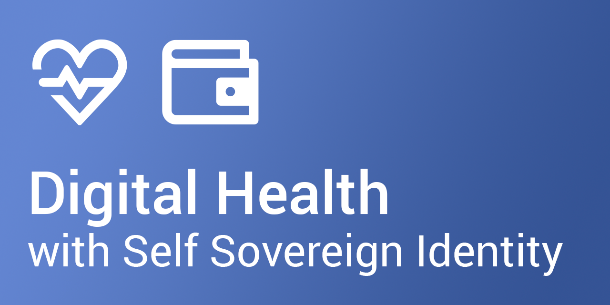
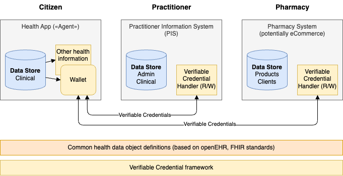

# Health SSI Generation 2

Welcome to the Health SSI repository!

We are aiming to showcase healthcare use cases based on Self Sovereign Identity (SSI) principles.

This repository builds on the original idea of [Health SSI](https://github.com/janesp/health-ssi) and the subsequent award-winning [challenge](https://hack.opendata.ch/project/1103) at the [GovTech Hackathon 2024](https://www.bk.admin.ch/bk/en/home/digitale-transformation-ikt-lenkung/bundesarchitektur/api-architektur-bund/govtech-hackathon24.html). Check out the short «making of» [video](https://youtu.be/uNrMFE2wOyQ) with the live demonstration at the final pitch.

A health app proof of concept was built in 2022 with a FHIR server backend ([short video](https://youtu.be/T5bYmy_oXMo)). The Health SSI showcase app shall be implemented with a wallet as data store.

# Use Cases

To showcase the interaction of several participants of the healthcare system and their wallets, a few simple and easy to comprehend use cases are envisaged for the implementation of the PoC:

* The patient John Miller carries a wallet with information of an international patient summary (allergies, medication, etc.) and a health insurance card in the form of previously issued VCs
* John enters the office of Dr. Charles Brewster and registers through a QR code; this initiaites a proof request for insurance and health information in John's wallet, which is subsequently confirmed by John
* Dr. Brewster issues the findings of his examination as a VC and prescribes some drugs, also in the form of VCs
* After the visit, John orders the drugs through the «Universal Pharmacy» online store by presenting the prescription VCs

See also [Health SSI](https://github.com/janesp/health-ssi).

# Envisaged Implementation

## Architecture

While the hackathon showcase made simplifications for timely implementation, the next proof of concept shall have a state of the art architecture:

* Modular components with APIs to issue and verify healthcare specific verifiable credentials
* Simulations of practitioner and pharmacy «business systems» with appropriate user interfaces
* Wallet for citizen to hold verifiable credetials

* All participating (healthcare) «business platforms» are based on common health data object definitions, based on openEHR and FHIR standards (technically based on json schemas)
* A verifiable credential framework provides generic VC operations such as wallet functionality, as well as VC issuing and verification ([walt.id](https://walt.id/) for the upcoming PoC)
* Healthcare specific VC operations are provided by a «business logic» on top of the generic VC framework (through library and REST API interfaces based on [Kotlin Multiplatform](https://kotlinlang.org/docs/multiplatform.html))

## Technology

Currently used for first PoC implementation and planned for next steps.

* Verifiable credentials
  * Simplified JSON payload objects for first feasability validations
  * Payload based on JSON-LD schemas (directly taken from [openEHR](https://specifications.openehr.org/releases/ITS-JSON/latest) and [FHIR](https://www.hl7.org/fhir/fhir.schema.json))
  * SD-JWT signatures
  * Option for BBS+ signatures at a later stage ([Verifiable Credentials Playground](https://vcplayground.org), tbc)
* Verifiable Credential framework with REST and library APIs to manage generic verifiable credentials ([walt.id](https://walt.id/))
* Front end (app, desktop) and business logic based on multiplatform environment
  * [Kotlin Multiplatform](https://kotlinlang.org/docs/multiplatform.html)
* Wallet - [esatus](https://esatus.com/en/digital-identity/), [Lissy](https://www.lissi.id/for-users), ... (during next stage); preferably with APIs for credential manipulation from app

In case you are interested in the code, check out our [development repository](https://github.com/deak-ai/healthwallet).

Note - the original idea of no code environments was dropped ([FlutterFlow](https://flutterflow.io/), [BuildShip](https://buildship.com/)).

# Contributors

* [Peter Janes](https://www.linkedin.com/in/peterjanes/) - [DIDAS](https://www.didas.swiss) Health working group lead, GovTech Hackathon challenge owner
* [Oliver Deak](https://www.linkedin.com/in/oliver-deak/) - technology and development specialist

# Envisaged Showcase Events

* [DICE 2024](https://diceurope.org), June 2024 - check out our [short video](https://youtu.be/CaEMHeJBKr8)
* [Forum Gesundheitsdatenraum Schweiz](https://gesundheitsdatenraum.ch/uploads/Dokumente/20240411_v2_GdS_Flyer.pdf), June 26, 2024
* [Digital Days Aarau](https://www.digitaldaysaarau.ch), October/November 2024
* ...
