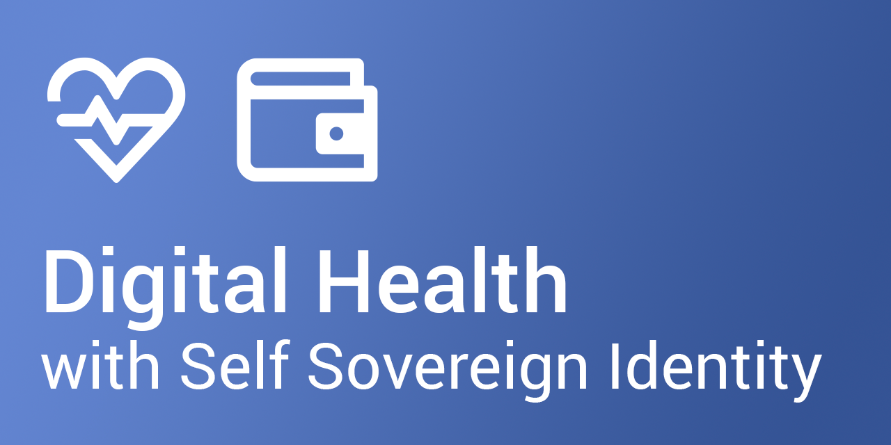

# Health SSI Generation 2

Welcome to the Health SSI repository!

We are aiming to showcase healthcare use cases based on Self Sovereign Identity (SSI) principles.

This repository builds on the original idea of [Health SSI](https://github.com/janesp/health-ssi) and the subsequent award-winning [challenge](https://hack.opendata.ch/project/1103) at the [GovTech Hackathon 2024](https://www.bk.admin.ch/bk/en/home/digitale-transformation-ikt-lenkung/bundesarchitektur/api-architektur-bund/govtech-hackathon24.html). Check out the short «making of» [video](https://youtu.be/uNrMFE2wOyQ) with the live demonstration at the final pitch.

# Use Cases

See [Health SSI](https://github.com/janesp/health-ssi).

# Envisaged Implementation

## Architecture

While the hackathon showcase made simplifications for timely implementation, the next proof of concept shall have a state of the art architecture:

* Modular business logic components with APIs to issue and verify verifiable credentials
* Simulations of practitioner and pharmacy systems with appropriate user interfaces
* Wallet for citizen to hold verifiable credetials

## Technology

Initial considerations for review.

* Verifiable credentials
  * Payload based on JSON-LD schemas (directly taken from [openEHR](https://specifications.openehr.org/releases/ITS-JSON/latest) and [FHIR](https://www.hl7.org/fhir/fhir.schema.json))
  * SD-JWT signatures
  * Option for BBS+ signatures at a later stage ([Verifiable Credentials Playground](https://vcplayground.org), tbc)
* REST APIs to manage verifiable credentials ([walt.id](https://walt.id/))
* Option for prototyping - no code environments (see short example [video](https://youtu.be/2OzgeHxpMs4))
  * Apps ([FlutterFlow](https://flutterflow.io/))
  * Systems for practitioner and pharmacy ([BuildShip](https://buildship.com/), tbc)
* Front end (app, desktop) and business logic based on multiplatform environment
  * [Kotlin Multiplatform](https://kotlinlang.org/docs/multiplatform.html)
* Wallet - [esatus](https://esatus.com/en/digital-identity/), [Lissy](https://www.lissi.id/for-users), ...; preferably with APIs for credential manipulation from app

# Envisaged Showcase Events

* [DICE 2024](https://diceurope.org), June 2024
* [Digital Days Aarau](https://www.digitaldaysaarau.ch), October/November 2024
* ...
